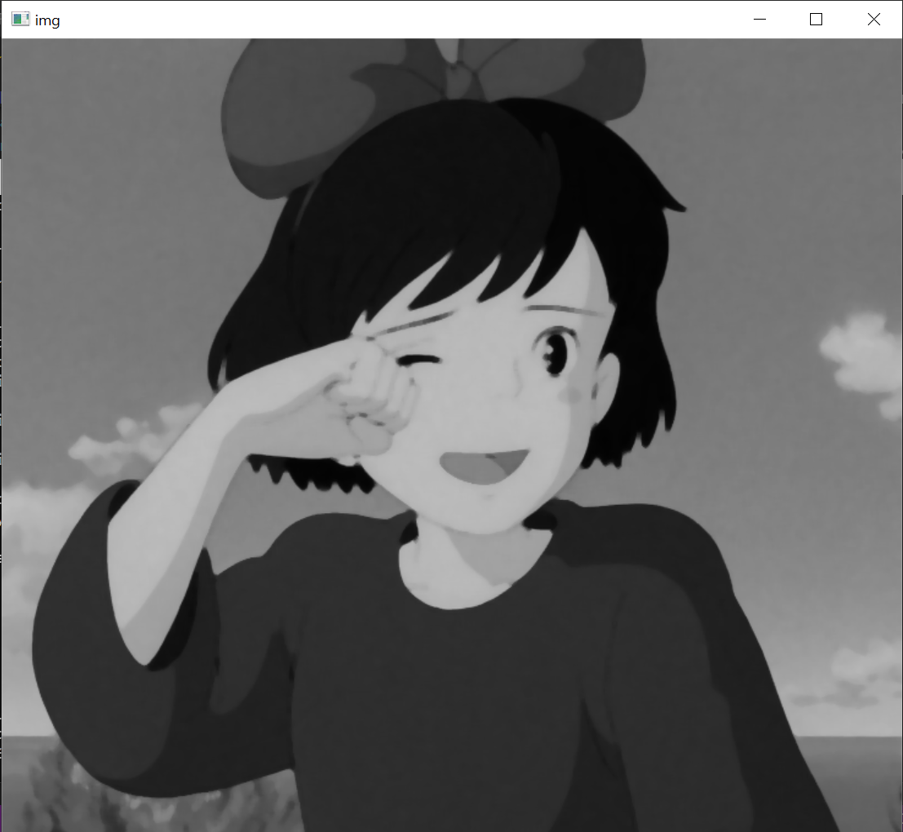
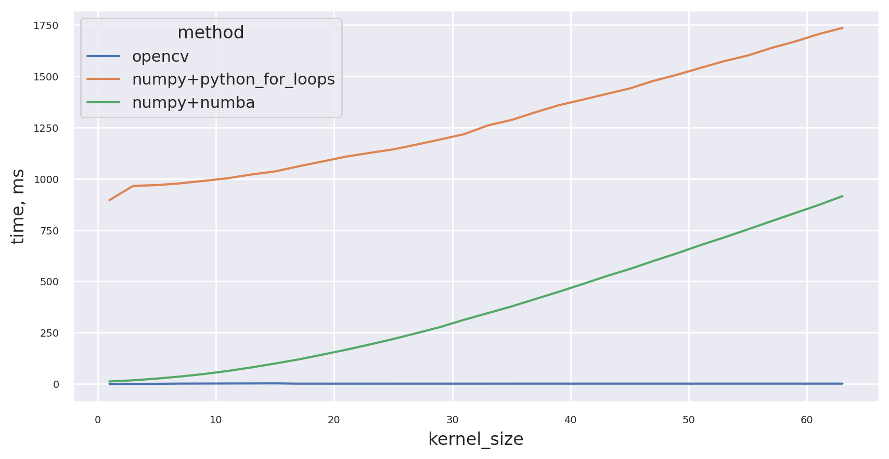

# Теоретическая база  
### Медианный фильтр  
Медианный фильтр — один из видов цифровых фильтров, широко используемый в цифровой обработке сигналов и изображений для уменьшения уровня шума. Медианный фильтр является нелинейным КИХ-фильтром. Медианная фильтрация — эффективная процедура обработки сигналов, подверженных воздействию импульсных помех. [1]

### Конвертация в grayscale  
Яркость высчитыватся по стандтарту CCIR 601 [2], путем складывания 3 каналов изображения умноженных на соотвествующие веса.  

# Описание разработанной системы
Была написана программа на языке Python, которая реализует конвертацию в grayscale и медианный фильтр. Медианный фильтр реализован 3 разными способами: с помощью библиотеки OpenCV, с помощью numpy и комбинация numba и numpy.  
Алгорим проходит по всем пикселям изображения и заменяют их на медианное значение пикселей в окрестности. Для решения проблемы с границами изображения (если рассматривать пиксель на границе изображения, то у него не достаточно соседей для работы алгоритма) был примененен BORDER_REPLICATE [3], так же, как это делается в OpenCV.
# Результаты работы и тестирования системы
Исходное изображение  
   
Изображение сконвертированное в grayscale  
   
Изображение после применения медианного фильтра с ядром 7.  
  
Также было проведено тестирование производительности различных реализаций медианного фильтра на изображении 221x221 с разными размерами ядра.     
 
# Выводы по работе
В результате работы был реализован медианный фильтр, причем результаты его работы идентичны результатам получаемым с помощью OpenCV (изображения имеют одинаковые хеши)
# Использованные источники
[1] https://ru.wikipedia.org/wiki/Медианный_фильтр  
[2] https://en.wikipedia.org/wiki/Luma_(video)#Rec._601_luma_versus_Rec._709_luma_coefficients  
[3] https://stackoverflow.com/questions/61183379/how-does-opencv-medianblur-actually-work
